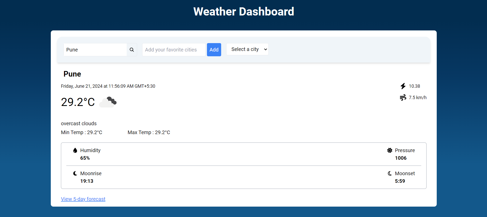
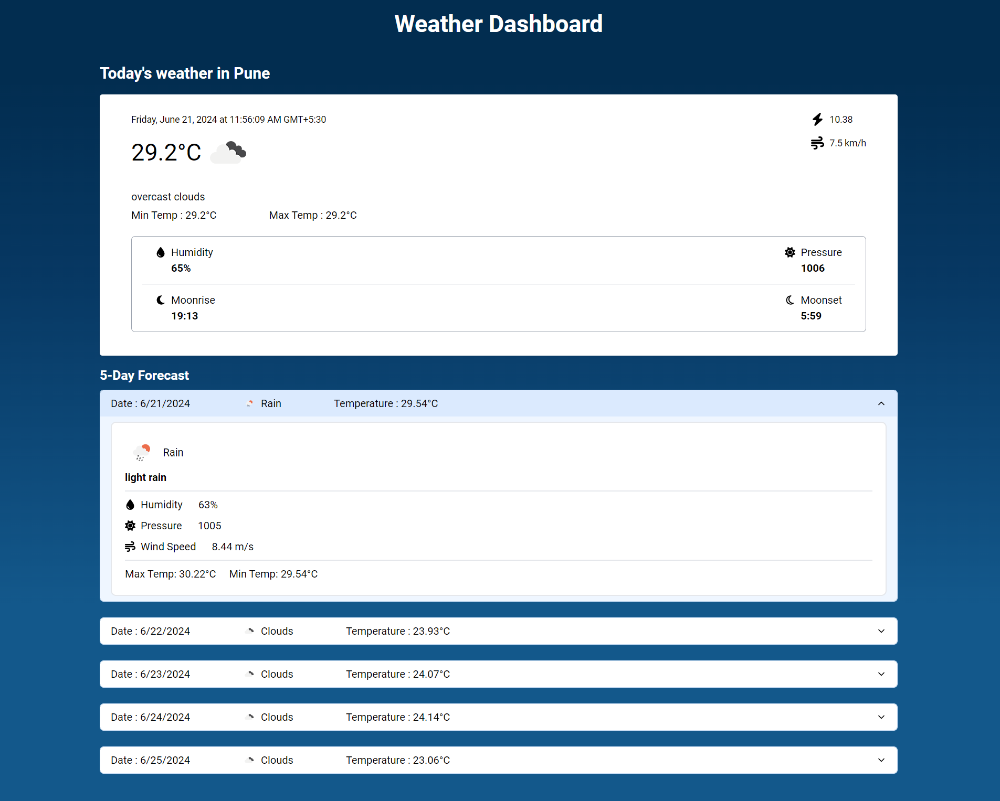

# Weather Dashboard

## Description
A weather dashboard application built with Next.js. It allows users to search for the current weather and 5-day forecast for different cities.

## Table of Contents

- [Features](#features)
- [Technologies Used](#technologies-used)
- [Installation](#installation)
- [VisualDemo](#VisualDemo)

## Features

### Home Page
- Search Bar
- On search, display the current weather for the entered city
- Link for navigate to the Weather Details Page
- Save favorite cities and quickly access their weather information
- Error handling for invalid city names or API errors
- Responsive UI

### Weather Details Page
- Fetch and display the current weather and 5-day forecast for the city
- Include details like temperature, humidity, weather description, wind speed, and icons for each day
- Dynamic & responsive UI design

## Technologies Used

- **Next.js**
- **JavaScript**
- **Tailwind CSS**
- **Open Weather API tool**
- **Other- Icons, Router**

## Installation

### Prerequisites

- Node
- npm

### Steps

1. **Clone the repository**:
    ```bash
    git clone https://github.com/shwet20/weather-app.git
    cd weather-dashboard
     ```

2. **Navigate to the project directory**:
     ```bash
    cd weather-dashboard
     ```

3. **Install dependencies**:
    ```bash
    npm install
    ```

4. **Create a `.env.local` file in the root directory and add your OpenWeatherMap API key**:
     ```bash
     NEXT_PUBLIC_WEATHER_API_KEY=your-api-key
     ````

4. **Start the development server**
     ```bash
     npm run dev
     ````

## VisualDemo



